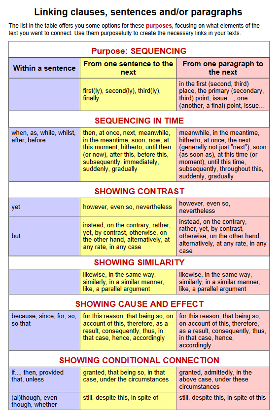

# Megadott téma
- ellentmondásos
- provokatív
- több nézőpontból megvitatható
# Terjedelem
> Ez a terjedelem elsősorban ajánlás, alapból nem büntetjük az ettől való eltérést (többnyire túllépést).

| Típus | Szó	|
| ---	| ---	|
| B2	| ~150	|
| C1	| ~200	|
# Tartalom
- nem kell meggyőzni az olvasót
- felépített gondolatmenet
- téma kifejtése
- ~~mélynek kell lennie~~
- ~~nem szabad felszínesnek lennie~~
- legalább 1 ellenérv, kötőszavakkal bekötés
	- `Alternatively,...`
	- `As opposed to this,...`
- kötőszavak
	- ~~`Firstly`~~ (nem felsorolás)
	- ~~`Secondly`~~ (nem felsorolás)
	- `In other words,...`
	- `Admittedly,...`
	- `In clear contrast to these points,...`
	- `On the one hand,...`, `On the other hand,...`
	- `In consequence,...`
	- `As a result,...`
	- `To sum up,...`
	- `In conclusion,...`
	
- ~~tanácsadás~~
- ~~önmagunkra utalás~~
# Nyelvezet
- ~~összevont alakok~~
- ~~csevegő szóhasználat~~
- távolság tartó fogalmazás
# Bevezetés
- figyelem felkeltése
	- erős példa
	- erős benyomás
	- hangzatos vélemény említése
- álláspont közlés
	- ~~címre utalás~~
# Tárgyalás `2-3 bekezdés`
- első mondat kulcsmondat
	- fő érv kifejtése
- kulcsmondat
	- indoklása
	- erősítése
	- kiegészítése
# Befejezés
- záró következtetések
- ~~érvek szó szerinti megismétlése~~
- ~~új érvek felvetése~~
- ~~olvasó meggyőzése az igazunkról~~
	- nem lehet eldönteni hogy igaz-e a kijelölt téme állítása